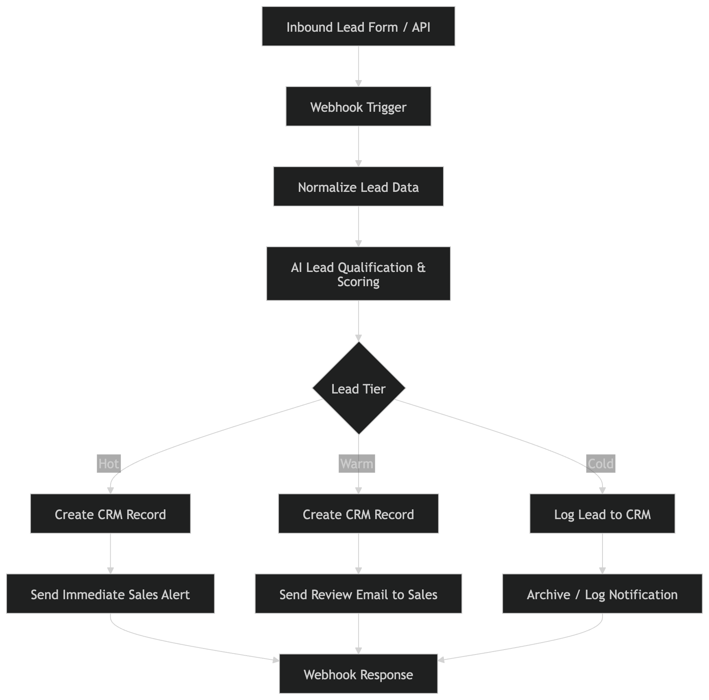

# AI Inbound Lead Qualifier

AI-powered inbound lead qualification workflow built with **n8n**, **LLM scoring**, and **automated routing**.

This system ingests inbound leads through a webhook, evaluates ICP fit and buying intent using an LLM, classifies leads into **hot / warm / cold tiers**, logs them to a CRM-style database, and triggers **tier-based notification workflows**.

The project demonstrates a lightweight **AI-native GTM automation pipeline** similar to what early-stage startups build internally to manage inbound demand.

---

# Overview

Inbound leads often arrive through forms or APIs but require manual triage to determine which leads deserve immediate sales attention.

This workflow automates that process by:

1. Receiving inbound lead data through a webhook  
2. Normalizing the input schema  
3. Scoring the lead using an LLM  
4. Classifying the lead by **ICP fit and buying intent**  
5. Routing the lead into **hot / warm / cold pipelines**  
6. Logging the lead into a CRM table  
7. Triggering **tier-based email alerts**  
8. Returning a structured webhook response  

---

# Architecture




---

# Workflow Overview

The workflow consists of four primary stages.

### 1. Lead Intake

Inbound leads enter the system through a **webhook endpoint**.

This allows the workflow to integrate with:

- website forms
- backend APIs
- marketing automation systems
- third-party lead sources

Example webhook endpoint:

```
POST /webhook/inbound-lead
```

---

### 2. Lead Normalization

Incoming lead data is normalized into a consistent schema so downstream automation steps can rely on predictable fields.

Typical normalized fields include:

- fullName  
- email  
- company  
- jobTitle  
- employeeCount  
- message  
- source  

---

### 3. AI Lead Qualification

An LLM evaluates the lead based on:

- ICP fit  
- buying intent  
- company context  
- role seniority  
- urgency signals  

The model returns structured JSON including:

```
lead_score
qualified
segment
priority
reason
```

The workflow parses this output and derives:

```
aiScore
aiTier
aiAction
```

Lead tiers:

| Tier | Description |
|-----|-------------|
| Hot | High intent + strong ICP fit |
| Warm | Relevant but exploratory |
| Cold | Low fit or non-commercial inquiry |

---

### 4. Tier-Based Routing

Leads are routed into one of three pipelines.

#### Hot Leads
- logged to CRM table  
- immediate sales alert email sent  
- webhook response returned  

#### Warm Leads
- logged to CRM table  
- review notification email sent  

#### Cold Leads
- logged to CRM table  
- low-priority notification sent  

---

# Example Input

Example inbound lead payload:

```json
{
  "firstName": "Alex",
  "lastName": "Rivera",
  "email": "alex.rivera@fintechco.com",
  "company": "FintechCo",
  "jobTitle": "Head of Growth",
  "employeeCount": 42,
  "source": "Website Demo Form",
  "message": "We need to automate inbound lead qualification and routing for our sales team this quarter and would like to see a demo."
}
```

---

# Example Output

Webhook response returned to the client:

```json
{
  "status": "ok",
  "tier": "hot",
  "score": 85
}
```

---

# CRM Logging

Leads are stored in a **Google Sheets table acting as a lightweight CRM database**.

Example row:

| fullName | company | aiScore | priority | aiTier |
|--------|--------|--------|--------|--------|
| Alex Rivera | FintechCo | 85 | high | hot |

Fields logged include:

- submittedAt  
- fullName  
- email  
- company  
- jobTitle  
- source  
- message  
- aiScore  
- priority  
- aiTier  
- reason  

---

# Notification System

Email alerts are sent based on lead tier.

Hot leads trigger **immediate sales notifications** including:

- lead details  
- AI score  
- qualification reasoning  
- contact information  

Warm and cold leads generate **lower priority notifications** for tracking and follow-up.

---

# Demo

Video walkthrough of the workflow:

https://www.loom.com/share/23a26d1ac7dd4c1d8b24cefb7aedf39e

The demo shows:

1. sending a sample webhook request  
2. workflow execution  
3. AI lead scoring  
4. CRM logging  
5. email alert  
6. structured API response  

---

# Technologies Used

- **n8n** — workflow automation platform  
- **LLM API** — AI lead qualification  
- **Google Sheets** — lightweight CRM logging  
- **Gmail API** — automated notifications  
- **Webhook API** — inbound lead ingestion  

---

# Potential Extensions

Possible production enhancements:

- CRM integrations (HubSpot, Salesforce)  
- Slack or CRM task notifications  
- enrichment with Clearbit or Apollo  
- lead scoring feedback loops  
- lead deduplication  
- batch ingestion support  

---

# Author

Built as part of a **GTM Engineering portfolio project** exploring AI-native revenue operations automation.

---

# License

MIT License
